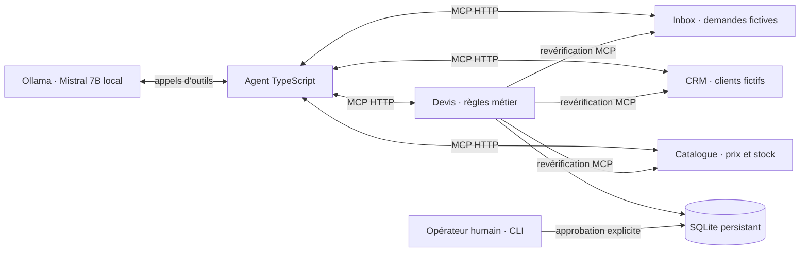

# Kadran · Local MCP Agent Proof

**Un agent local transforme une demande de PME en devis à valider, en connectant quatre services via MCP. Sans clé API.**

Projet de démonstration de Nicolas Hedoire : TypeScript, Mistral via Ollama, MCP sur HTTP, Docker Compose, persistance SQLite et tests d'intégration. Le code et les données sont conçus pour être examinés et exécutés par un recruteur. Toutes les sociétés, demandes et produits sont fictifs.

**Preuves disponibles :** tests Docker, exécution réelle de Mistral en 7 tours avec trace MCP et devis vérifié, puis contrôles de fin explicites pour éviter les recherches répétées sur un dossier incomplet. [Voir les résultats, les échecs observés et leurs limites](evidence/README.md).

## Essayer avec Docker

Prérequis : Docker avec Compose, au moins 12 Go d'espace libre pour images, modèle et marge de travail. Pour Mistral 7B, prévoir au moins 8 Go de mémoire disponibles pour Ollama ; 16 Go de RAM système ou plus sont conseillés. Le premier lancement télécharge les dépendances et environ 4,4 Go de poids. Les suivants réutilisent le volume du modèle.

```sh
git clone https://github.com/nicolashedoire/kadran-mcp-proof.git
cd kadran-mcp-proof
docker compose --profile llm up -d --build agent
docker compose logs -f agent
```

Le résultat JSON et les appels du modèle sont conservés dans un volume, même après l'arrêt des conteneurs. La première demande produit un devis de **636 € HT**, statut `pending_human_review`. Le texte final du modèle reste une sortie non fiable ; le champ `result.quote` provient du service de devis.

```sh
mkdir -p runtime
docker compose cp agent:/output/. ./runtime/
docker compose --profile llm down
```

Après installation, l'inférence utilise le modèle local. Aucun fournisseur d'IA payant ni compte cloud n'est nécessaire. Aucun port de service n'est publié sur l'hôte par défaut.

## Vérifier sans télécharger de modèle

```sh
docker compose --profile test run --build --rm tests
docker compose --profile demo run --build --rm demo
```

Le premier lance les tests, le second exécute cinq cas métier et rejoue le premier pour vérifier l'idempotence. Le second est un **pilote de scénarios déterministe**, explicitement distinct de l'agent Mistral. Les deux utilisent de vrais échanges MCP HTTP avec découverte des outils et validation des arguments.

## Fonctionnement



L'agent découvre les six outils au démarrage et construit un schéma JSON de décisions à partir de leurs contrats MCP. Mistral choisit un outil et ses arguments dans ce format contraint ; l'agent l'exécute via MCP et retourne le résultat au modèle. Aucun appel métier n'est choisi automatiquement à sa place. Il s'arrête au plus tard après 12 tours ou 24 appels d'outils. Le service de devis relit les sources via MCP et calcule les montants en centimes. Une consigne dans le texte d'un message ne peut pas créer un outil d'envoi ou d'approbation.

| Service | Outils MCP | Responsabilité |
|---|---|---|
| Inbox | `list`, `get` | Demandes issues d'un formulaire structuré et texte libre non fiable |
| CRM | `find` | Correspondance exacte entre adresse du demandeur et client |
| Catalogue | `get` | Prix HT en centimes et disponibilité fictive |
| Devis | `prepare`, `get` | Vérification des sources, calcul, persistance et idempotence |

## Mode autonome

```sh
docker compose --profile llm --profile worker up -d --build worker
docker compose logs -f worker
```

Le worker traite les demandes disponibles, conserve son avancement, puis vérifie la file toutes les 60 secondes. Une reprise continue les demandes restantes ; un devis déjà persistant est repris sans nouvelle inférence. Les erreurs d'inférence sont réessayées sur trois passages maximum. Les résultats nécessitant une intervention humaine et les budgets épuisés sont conservés pour revue, sans relance automatique.

La file fournie contient cinq demandes fixes. Pour une démonstration commerciale, la source inbox serait remplacée par un adaptateur vers le formulaire, le CRM ou la messagerie de la PME. Un seul worker doit utiliser le volume d'état : cette version n'est pas un ordonnanceur distribué.

L'autonomie couvre la lecture, les recherches et la préparation. **L'approbation est une commande d'opérateur et aucun envoi réel n'est implémenté.**

```sh
docker compose exec quotes node dist/src/cli.js approve m-100
```

Cette commande marque l'approbation dans SQLite ; elle n'envoie aucun document. L'agent n'a pas accès à cette commande, au socket Docker ni au volume de devis.

## Mac Apple Silicon : option GPU

Le mode entièrement Docker exécute Ollama sur CPU sur macOS. Pour utiliser Metal, lancer Ollama nativement tout en conservant l'agent et les quatre services dans Docker. Si le modèle est déjà installé dans Docker, l'installation native stocke une seconde copie d'environ 4,4 Go : prévoir cet espace supplémentaire avant de la lancer.

```sh
# Dans un terminal, si l'application Ollama n'est pas déjà démarrée :
ollama serve
# Dans un autre terminal :
ollama pull mistral:7b-instruct-v0.3-q4_K_M
docker compose -f compose.yaml -f compose.native.yaml --profile native up -d --build agent
docker compose -f compose.yaml -f compose.native.yaml logs -f agent
```

L'override nécessite Compose ≥ 2.24.4 et autorise l'agent à joindre `host.docker.internal`. Sur Linux avec GPU NVIDIA, configurer le runtime NVIDIA et l'accès GPU d'Ollama selon sa documentation ; le fichier principal reste portable sur CPU.

## Ce que les preuves couvrent

Les tests vérifient le protocole MCP, les schémas stricts, les incohérences client/demande, les quantités manquantes, le stock, les doublons concurrents, la reprise SQLite, une réponse perdue après écriture et les budgets d'agent. Ils incluent des réponses de modèle simulées pour vérifier les contrôles indépendamment de ses capacités.

Les exécutions réelles du modèle sont conservées séparément dans [evidence](evidence/README.md). Une exécution réussie démontre ce cas précis ; elle ne constitue pas une mesure générale de fiabilité du modèle ou d'immunité aux injections.

- [Architecture et décisions](docs/architecture.md)
- [Parcours d'entretien et limites](docs/interview.md)
- [Code de l'agent](src/agent.ts), [client MCP](src/hub.ts), [règles de devis](src/quotes.ts)
- [Tests examinables](tests/integration.test.ts)
- [Configuration CI prête à activer](docs/ci/README.md) — les preuves actuelles ont été exécutées localement.

## Développement local

Node.js 24 est requis. Sans variables de connexion, la CLI démarre automatiquement quatre serveurs HTTP temporaires dans le même processus. Docker utilise quatre conteneurs distincts.

```sh
npm ci
npm test
npm run demo
npm run agent -- m-100
```

Les sorties locales sont dans `runtime/` et exclues de Git. Les volumes Docker conservent les données. `docker compose down` arrête les services ; ne supprimer les volumes que pour réinitialiser volontairement la démonstration, car cela supprime aussi le modèle téléchargé.

## Positionnement

Ce projet, créé pour rendre mon travail examinable, prolonge mon axe Kadran : automatiser des tâches concrètes de PME avec des outils, des traces et une validation humaine. Il a été développé avec une assistance IA. Il ne représente ni une mission client livrée ni un résultat commercial mesuré. Les connecteurs métier sont des démonstrateurs locaux, pas des connexions actives à Gmail, HubSpot ou un ERP.

Auteur : [Nicolas Hedoire](https://nicolashedoire.com). Licence MIT pour ce code ; les dépendances et les poids du modèle conservent leurs licences propres.

Références : [SDK MCP officiel](https://github.com/modelcontextprotocol/typescript-sdk), [appels d'outils Ollama](https://docs.ollama.com/capabilities/tool-calling), [Mistral 7B](https://ollama.com/library/mistral), [Ollama et accélération GPU](https://docs.ollama.com/faq), [ordre de démarrage Compose](https://docs.docker.com/compose/how-tos/startup-order/).
