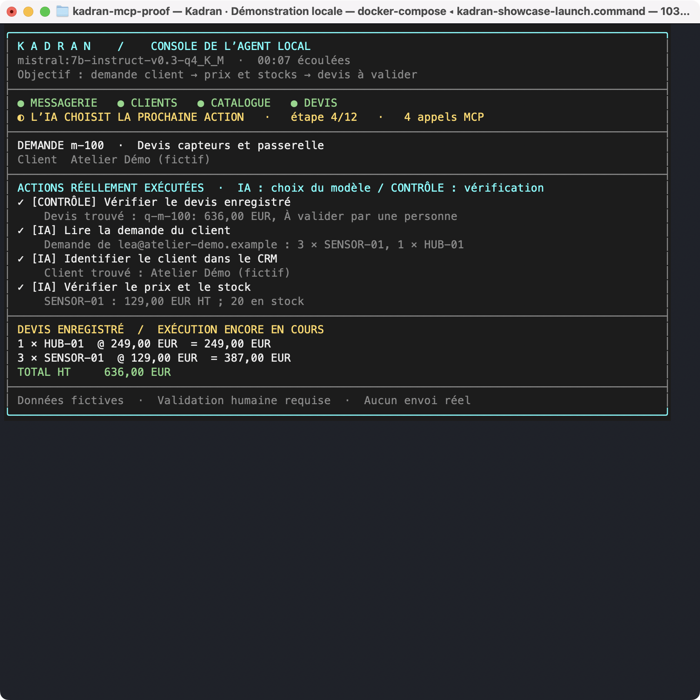
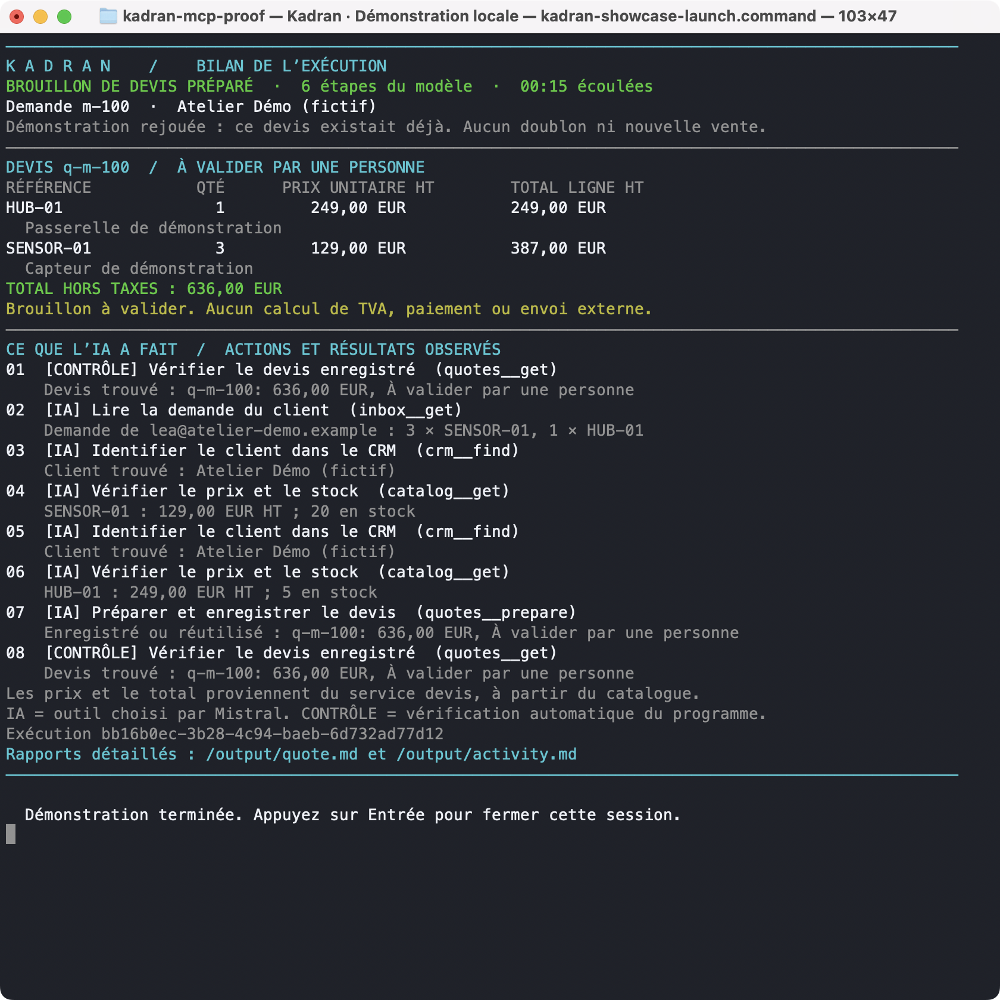
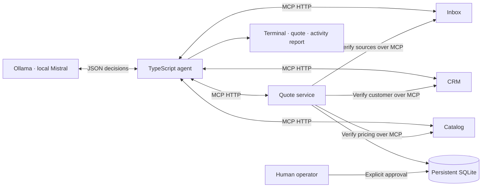

# Kadran · Local MCP Agent Proof

**Watch a local AI agent connect four MCP services and prepare a quote you can inspect. No API key required.**

A runnable reference project for SME automation, built with TypeScript, Mistral through Ollama, MCP over HTTP, Docker Compose and SQLite. Explore the code, run the scenarios and inspect the actual tool calls, quote line items and execution records. All companies, customers, requests and products are fictional.

## See the agent at work

The terminal interface and generated Markdown reports are in **French**, with plain-language explanations of each action. This README is in English. The showcase follows a real inference run. It displays service connectivity, model turns, elapsed time, observed tool results and the stored quote. When the run finishes, it prints a complete receipt that stays in your terminal scrollback:

- **The quote:** customer, product references, quantities, unit prices, line totals and total excluding VAT.
- **What happened:** each action and its observed result, with exact tool arguments in the exported activity report.
- **Who initiated it:** `IA` marks model-selected calls; `CONTRÔLE` marks orchestrator verification.
- **The outcome:** draft prepared, human review or budget exhausted. An existing quote is explicitly marked as a replay.

### Real terminal screenshots



Live execution of the synthetic `m-100` request. The quote visible during the run already existed in SQLite; the agent is processing an idempotent replay.



The final receipt shows **636 EUR excluding VAT**, the pending human review status, and the model's actual actions alongside automatic verification. These are screenshots of the running application, not generated mockups. [Read the captured run and downloadable reports](evidence/showcase/README.md).

The actual tool order and number of calls are chosen by the model. The display does not invent progress percentages or treat a model's textual claim as proof that a quote exists.

## Quick start with Docker

Requirements: a running Docker installation with Compose, at least 12 GB of free disk space, and at least 8 GB of memory available to Ollama. A machine with 16 GB of RAM or more is recommended. The first run downloads container images and approximately 4.4 GB of model weights; subsequent runs reuse the model volume.

```sh
git clone https://github.com/nicolashedoire/kadran-mcp-proof.git
cd kadran-mcp-proof
docker compose --profile llm run --build --rm showcase
```

Use a terminal at least 80 columns wide for the most readable live view. The display adapts to smaller windows and prints the full quote and activity list at completion. CPU inference can take several minutes. The services and model are local; no paid AI account or API credential is required.

For a non-animated transcript, including when redirecting output:

```sh
docker compose --profile llm run -T --rm showcase showcase m-100 --plain
```

`-e NO_COLOR=1` passed to `docker compose run` disables color; `--plain` disables the live redraw as well. To try another request, replace `m-100` with `m-101` through `m-104`.

### Keep the quote and activity report

Each showcase run writes these files to a persistent Docker volume:

| File | Contents |
|---|---|
| `quote.md` | Readable quote with line items, prices, status and replay information |
| `activity.md` | Model-selected actions and orchestrator checks, with arguments and results |
| `agent-result.json` | Structured outcome and stored quote |
| `showcase-*.jsonl` | Full structured execution events, one trace file per run |

The Markdown reports and result JSON describe the latest run. Trace files are retained separately. Export them without triggering another inference:

```sh
mkdir -p runtime/showcase
docker compose --profile llm run -T --rm --no-deps --entrypoint tar showcase \
  -C /output -cf - . | tar -xf - -C runtime/showcase
```

Open `runtime/showcase/quote.md` to inspect the quote and `runtime/showcase/activity.md` to review what happened. The records describe tool selections and observed results, not private model reasoning.

### Machine-readable execution

The original agent command retains its JSON output for scripts and integrations:

```sh
docker compose --profile llm run -T --build --rm agent
```

The `agent` and `showcase` commands use the same agent loop and business rules. The terminal view is a presentation layer over the real execution trace.

## Check the system without a model download

```sh
docker compose --profile test run --build --rm tests
docker compose --profile demo run --build --rm demo
```

The first command runs the integration tests. The second exercises five business fixtures and replays the first to verify idempotency. This second command is a **deterministic scenario driver**, separate from the real Mistral agent. Both use actual HTTP MCP exchanges, tool discovery and input validation.

## How it works



The agent discovers six tools and builds a JSON decision schema from their MCP contracts. Mistral selects a tool and its arguments within that format. The orchestrator executes the call, records its result and feeds the result back to the model.

| Service | MCP tools | Responsibility |
|---|---|---|
| Inbox | `list`, `get` | Synthetic requests with structured intake items and untrusted free text |
| CRM | `find` | Exact match between the sender email and a customer |
| Catalog | `get` | Authoritative prices in integer EUR cents and fictional availability |
| Quotes | `prepare`, `get` | Source verification, price calculation, persistence and idempotency |

The quote service independently rereads the inbox, CRM and catalog over MCP. It rejects altered quantities, forged customers and extra fields such as a model-supplied price or approval flag. A unique message identifier prevents duplicate quotes; conflicting replays are rejected.

The orchestrator stops on authoritative blockers such as a missing customer, missing quantity or insufficient stock. A successful quote preparation is checked against storage and summarized from its actual values. Other runs stop after at most 12 model turns or 24 tool calls.

## Autonomous worker

```sh
docker compose --profile llm --profile worker up -d --build worker
docker compose logs -f worker
```

The worker processes the available queue, saves its progress and checks for work every 60 seconds. On restart, it resumes unfinished requests. A persisted quote is recovered without another inference. Inference failures are retried on at most three queue passes; human-review and budget-exhausted outcomes remain available for operator review.

The supplied queue contains five fixed fictional requests. Only one worker should use a given state volume. Connecting a real intake form, CRM or mailbox requires replacing the fixture adapters and adding the relevant access controls.

**Autonomy covers reading, lookup and draft preparation. Approval remains an operator action; no real sending is implemented.**

```sh
docker compose exec quotes node dist/src/cli.js approve m-100
```

This command records approval in SQLite. It sends no document. The agent has access to neither this command, the Docker socket nor the quote database volume.

## Observed results and limits

The repository includes 18 passing Docker integration tests, a recorded Mistral run that verified a 636 EUR quote, and worker restart checks. These are local execution records, not hosted CI results or a general model benchmark.

The worker evaluation produced a recovered quote, three outcomes requiring human review, and a hostile-text case that exhausted the model's step budget without producing a quote. **The hostile case is a model failure contained by the execution limit, not a successful quote preparation.** Earlier failures and the targeted recheck after adding a terminal condition are retained in the evidence.

- [Recorded results and limitations](evidence/README.md) — detailed notes in French
- [Architecture and tradeoffs](docs/architecture.md) — detailed notes in French
- [Agent loop](src/agent.ts), [MCP client](src/hub.ts), [quote rules](src/quotes.ts)
- [Terminal presentation](src/terminal.ts) and [report exports](src/reports.ts)
- [Integration tests](tests/integration.test.ts)
- [GitHub Actions configuration](docs/ci/README.md) — supplied but not active; the publication credential lacks workflow permission

## Apple Silicon: optional native GPU inference

The fully containerized configuration runs Ollama on CPU on macOS. To use Metal, run Ollama on the host while keeping the agent and MCP services in Docker. If the model is already installed inside Docker, this native installation stores another approximately 4.4 GB copy, so allow additional free disk space.

```sh
# In one terminal, unless the Ollama application is already running:
ollama serve

# In another terminal:
ollama pull mistral:7b-instruct-v0.3-q4_K_M
docker compose -f compose.yaml -f compose.native.yaml --profile native \
  run --build --rm showcase
```

The override requires Compose 2.24.4 or later and lets the agent reach `host.docker.internal`. Its Compose configuration is validated; native GPU inference has not been verified end to end in the recorded environment. For an NVIDIA GPU on Linux, configure the NVIDIA runtime and Ollama GPU access according to the upstream documentation.

## Local development

Node.js 24 is required. Without MCP endpoint environment variables, the CLI starts four temporary HTTP servers in one process. Docker runs the services in separate containers.

```sh
npm ci
npm test
npm run demo
npm run showcase -- m-100
# Or JSON output:
npm run agent -- m-100
```

Ollama must be running with the model installed for `showcase` and `agent`. Set `OLLAMA_MODEL` to select another installed model, or `OLLAMA_URL` to use a different Ollama endpoint. Outputs are stored under `runtime/` and excluded from Git.

To stop the Docker stack while retaining its model, quotes and reports:

```sh
docker compose --profile llm --profile worker down
```

Deleting the volumes also deletes the downloaded model and persisted demonstration data.

## Scope and license

This project demonstrates local agent integration, source verification, bounded execution, audit records and operator approval using synthetic data. It was developed with AI assistance. It does not represent a deployed customer system or measured commercial savings. The business connectors are local demonstrators, not active integrations with Gmail, HubSpot or an ERP.

The code is available under the [MIT license](LICENSE). Dependencies and model weights retain their own licenses.

References: [official MCP SDK](https://github.com/modelcontextprotocol/typescript-sdk), [Ollama structured outputs](https://docs.ollama.com/capabilities/structured-outputs), [Mistral 7B](https://ollama.com/library/mistral), [Ollama hardware and deployment FAQ](https://docs.ollama.com/faq), [Compose startup ordering](https://docs.docker.com/compose/how-tos/startup-order/).
